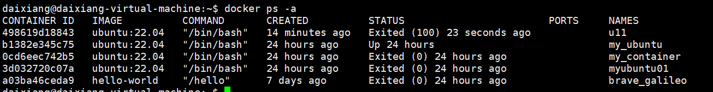

# docker的常用命令
## docker的启动与关闭
* 启动docker
>     systemctl start docker
* 关闭docker
>     systemctl stop docker
* 查看docker状态
>     systemctl status docker
* 重启docker
>     systemctl restart docker
* 设置开机启动 docker 服务 
>     systemctl enable docker 
## docker镜像命令
* 搜索镜像（从dockerhub中搜索） 
>     docker search 镜像名称
* 拉取镜像（不输入版本号默认拉取最新版本）
>     docker pull 镜像名称：版本号
* 查看本地镜像id
>     docker images -q
* 删除镜像  
>     docker rmi 镜像名称：版本号   
>     或者 docker rmi 镜像id
* 删除当地的所有的镜像(获取当前所有的镜像id再进行删除)
>     docker rmi `docker images -q`
* 导出镜像打包为压缩文件（可以将配置好环境的镜像打包成文件提供给其他机器使用）
>     docker save -o 文件名.tar 镜像名称:版本号
* 导入镜像文件（将别人打包好的镜像文件解压自己使用，测试中可以保存原来镜像的配置，等测试结束后会原来的配置）
>     docker load -i image.tar
* 使用Dockerfile构建构建镜像（Dockerfile文件是运行docker脚本的语言的文件，开发和测试中为了统一配置环境的一致性，可以将脚本写在Dockerfile文件中，其他人只要运行同样的脚本文件就看构建出同样环境的镜像容器了）
* * 运行Dockerfile文件构建镜像的命令
* >     docker build -f /path/Dockerfile -t image_name:tag .
* 注解：  
* docker build 命令是使用Dockerfile文件来构建镜像的命令
* -f 用来表示Dockerfile 文件的路径 ，默认在当前根目录下读取，Dockerfile文件名是统一的
* -t 生成镜像的名称和版本  

* * dockerfile 脚本编写命令
* **简单列举几个指令**
* FROM: 指定基础镜像
* WORKDIR: 指定工作目录
* COPY:将文件目录复制到容器中
* ADD:将文件目录复制到容器中并且对压缩文件进行解压，支持url
* RUN：在容器中执行命令
* CMD: 启动容器时执行的命令
* EXPOSE:指定要监听的端口实现与外部的通信  
文件脚本案例：
```(shell)
# nodejs server Dockerfile

# FROM node
# or
FROM node:16

WORKDIR /nodeApp

# COPY <宿主机目录或文件路径> <容器内目录或文件路径>
COPY ./package.json .
# ADD <宿主机目录或文件路径> <容器内目录或文件路径>
# ADD ./package.json .

# shell格式：就像在命令行中输入的Shell脚本命令一样。
RUN npm install

COPY ./src ./server

EXPOSE 8000

CMD ["node", "./server/index.js"]

```
脚本参考链接[点击此处](https://zhuanlan.zhihu.com/p/419175543)
## docker 容器命令
* 查看正在运行的docker容器  
>     docker ps
* 查看所有的docker容器
>     docker ps -a
* 查看最后一次运行的docker容器
>     docker ps -l
* 查看停止的docker容器
>     docker ps -f status=exited

## 创建docker容器的参数说明
* *-i :表示运行容器*
* *-t :表示运行后进入其命令行*
* *--name= :为创建的容器命名*  
* *-v :表示目录的映射关系，可以把宿主机的目录挂载到容器目录中*
* *-d :以守护式的方式来运行容器*
* *-p :端口映射 将宿主机的端口映射给容器端口*
* *-e :启动容器后并且运行命令行*  
  


* 使用交互式方法构建容器
>     docker run -it --name=容器名称 -p 宿主机端口号:容器端口号 镜像名:版本号 /bin/bash

注：交互式方式构建docker以后会自动进入容器，并且退出容器时容器停止运行  
* 使用守护式方法构建容器
>     docker run -di --name=容器名称 镜像名:版本号

注：守护式构建的容器不会直接进入docker容器，退回容器容器也不会自动关闭
* 进入doker容器
>     docker exec -it 容器名称(或容器id) /bin/bash

  
注:/bin/bash为容器的COMMAND字段，STATUS字段中up为运行状态，Exited为关机状态  
* 退出docker
>     exit
* 停止容器
>     docker stop 容器名（或容器id）
* 启动容器
>     docker start 容器名（或容器id）
* 将宿主机目录复制到容器目录
>     docker cp 宿主机目录 容器名(或容器id):容器目录 
* 将容器目录复制到宿主机目录
>     docker cp 容器名(或容器id):容器目录 宿主机目录
* docker 宿主机目录挂在到容器目录 
>     docker run -di -v 宿主机目录:容器目录 --name=容器名称 镜像名:版本号
* docker 查看容器信息  
>     docker inspect 容器名称(或容器id)
* docker 查看容器的ip地址
>     docker inspect --format='{{.NetworkSetting.IPAddress}}' 容器名称（或容器id） 

注：--format 执行表达式 获取信息中的NetworkSetting中的IPAddress的信息
* 删除docker 
>     docker rm 容器名:版本号（或容器id）

注：删除容器需要先关闭容器，删除镜像需要想删除所关联的镜像
* docker将容器打包成镜像
>     docker commit -m="描述信息" -a="作者" 容器id 目标镜像名：版本号  

注：可以与docker save -o 与docker load -i 组合使用来打包镜像文件
