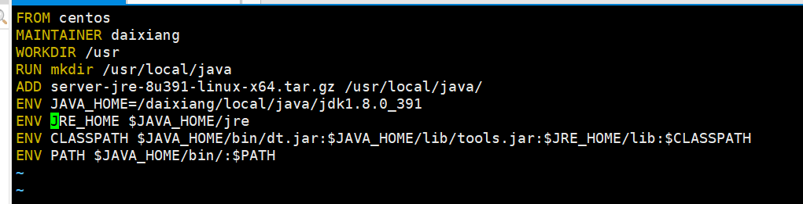

# 应用部署

## 部署mysql应用

1.拉取MySQL镜像(通过关键字查看镜像并拉取)
>     docker pull centos/mysql-57-centos7

2.创建容器
>     docker run -di --name=docker_mysql -p 3304:3306 -e MYSQL_ROOT_PASSWORD=123456 centos/mysql-57-centos7:latest

注: -p 把MySQL的3306端口映射到宿主机的3304  
-e 执行环境变量设置MySQL的root密码
3.远程连接MySQL
ip：宿主机ip 端口号3304 用户名 root 密码：123456

## Dockerfile 构建容器安装jdk

1. 创建一个Docker文件夹存放jdk文件与Dockerfile文件

>     mkdir Docker  
>     cd Docker

2. 编辑Dockerfile文件(内容如下)

注：WORKDIR一般设置为usr/local目录，该目录是Linux的用户目录
3. 运行Dockerfile文件构建镜像
>     docker build -t 镜像名：版本 -f Dockerfile文件路径 .

## docker创建私有仓库
1，拉去私有仓库镜像  
>     docker pull registry

2, 启动私有仓库镜像
>     docker run -di --name=registry -p 5000:5000 registry

3, 打开浏览器输入地址查看是否有{"registry":[]} 的响应内容
>     http//宿主机IP：5000/v2/_catalog

4,创建宿主机docker中的daemon.json配置文件
>     sudo vim /etc/docker/daemon.json

5，配置以下信息
>     {
>     "registry-mirrors": ["https://docker.mirrors.ustc.edu.cn"],
>     "insecure-registries":["宿主机IP:5000"]
>      }

6, 加载配置  
-     sudo systemctl daemon-reload 

7,重启docker
>     systemctl restart docker 

8,为需要要上传的镜像打上ip标识
>     docker tag 镜像名称：版本号 宿主机ip:5000/镜像名称

9，启动registry容器上传镜像到私有仓库(上传后在私有仓库链接中查看是否上传)
>     docker start registry  
>     docker push 宿主机ip:5000/镜像名称

10，下载私有仓库(先删除镜像测试是否可以拉取)
>     docker rmi 宿主机ip:5000/镜像名称
>     docker pull 宿主机ip:5000/镜像名称
