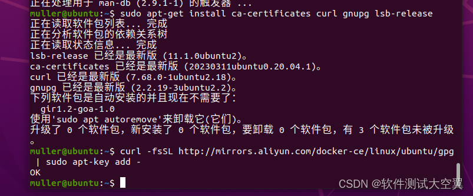

# ubuntu系统安装docker
Docker是一种流行的容器化平台，它能够简化应用程序的部署和管理。本文将介绍在Ubuntu操作系统上安装Docker的步骤，以便我们可以开始使用Docker来构建和运行容器化应用程序。  
## 检查卸载老版本的docker  
ubuntu一般会自带docker，但是版本一般比较低，名称一般是docker.io或者docker.engine来命名，我们在安装之前可以先卸载再安装新的版本。 
>     sudo apt-get remove docker docker-engine docker.io containerd runc

## 安装步骤  
* 1.更新软件包
    >     sudo apt update
* 2 .安装docker依赖  
    >     sudo apt-get install ca-certificates curl gnupg lsb-release
* 3 .添加Docker官方的GPG秘钥
    >     curl -fsSL http://mirrors.aliyun.com/docker-ce/linux/ubuntu/gpg | sudo apt-key add -
* 结果如下：
  
* 4 .添加docker的软件源  
    >     sudo add-apt-repository "deb [arch=amd64] http://mirrors.aliyun.com/docker-ce/linux/ubuntu $(lsb_release -cs) stable"
* 5 .安装docker
    >     apt-get install docker-ce docker-ce-cli containerd.io
* 6 .配置用户组（docker默认只有root用户可以启动，其他用户需要添加到docker用户组中才能使用）  
    >     sudo usermod -aG docker $USER 用户名称
* 查看docker版本
    >     docker version
* 运行docker  
    >     systemctl start docker  
* 安装工具 
    >     apt-get -y install apt-transport-https ca-certificates curl software-properties-common
* 重启docker 
    >     service docker restart 
* 验证工具，使用docker 运行镜像 当没有这个镜像时会远程下载该镜像
    >     sudo docker run hello-world
* 查看docker下载的本地镜像  
    >    docker images  
* 查看docker帮助命令
    >     docker --help
