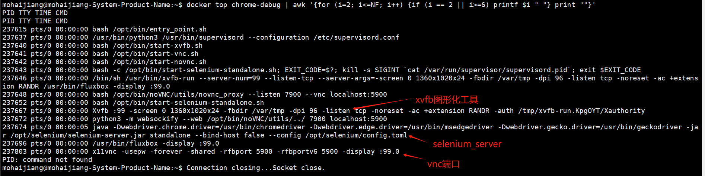
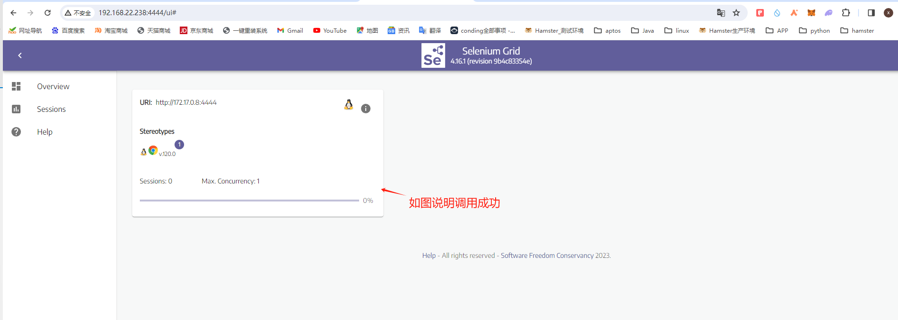
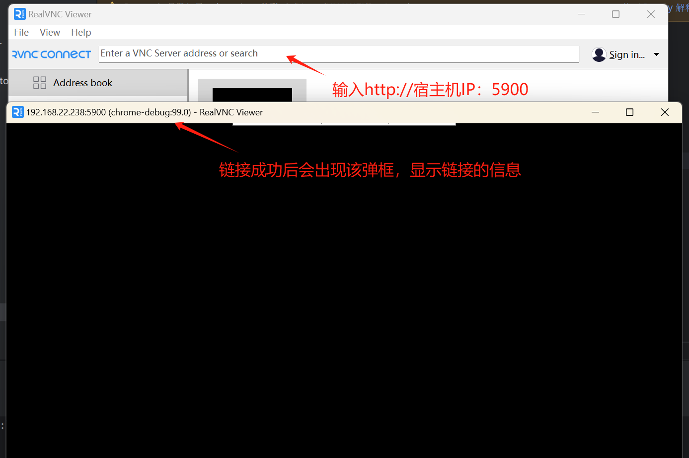
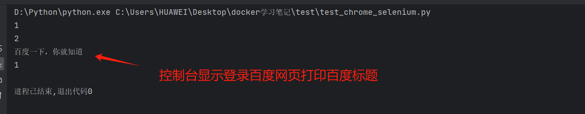
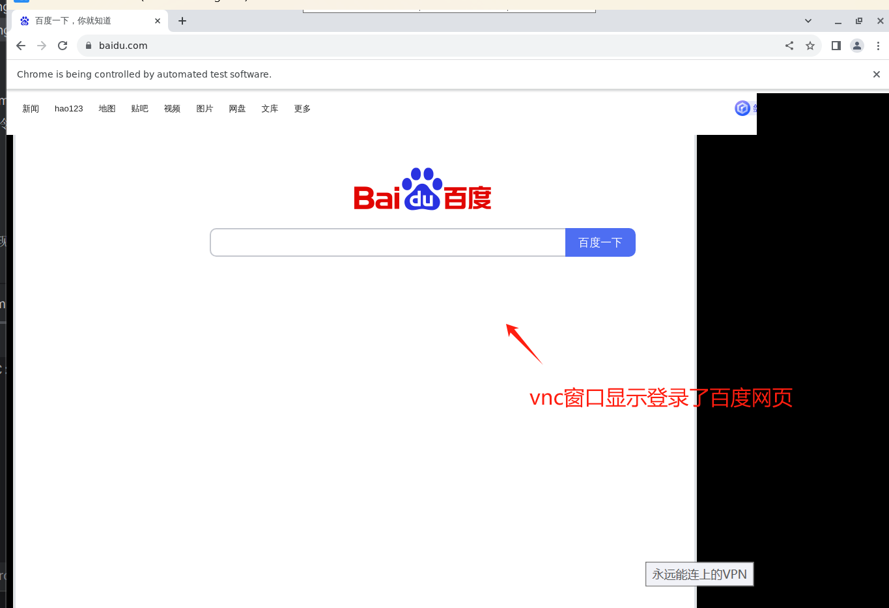

前提背景：ui自动化运行需要图形化的浏览器来进行调试，而脚本运行在Linux环境时无图形化的展示，会影响代码的运行
需要效果：构建一个docker的容器环境，该环境主要配置有chrome浏览器，webdriver驱动，以及vnc图形化远程调试
# 拉取镜像
[chrome镜像地址](https://hub.docker.com/r/selenium/standalone-chrome)  
1.使用selenium 提供的官方镜像 
>     docker pull selenium/standalone-chrome:120.0  

2.windows电脑需要安装vnc工具以及python，selenium运行环境  
[vnc下载前往](https://www.realvnc.com/en/connect/download/viewer/windows/)  
# 构建容器
3.服务器启动docker通过镜像构建容器  
>     docker run -tid --name=chrome-debug -h chrome-debug --memory 2g --memory-swap -1 -p 4444:4444 -p 5900:5900 selenium/standalone-chrome:120.0  

注：该命令命令是用于在服务器上运行一个名为 selenium-chrome 的Docker容器，该容器包含了Selenium和Chrome的组合  

- docker run: 这是Docker命令的基本部分，用于创建和运行一个新的Docker容器。  
- -ti: 这两个选项一起使用，表示在后台运行容器，并分配一个伪终端  
- -d: 是后台运行容器； -ti是分配一个伪终端，能够交互操作  
- --name=chrome-debug : 这个选项为容器指定一个名称，即 chrome-debug   
- -h chrome-debug 这个选项设置容器的主机名为 chrome-debug  
- --memory 2g: 这个选项指定容器的内存限制为2GB。这将限制容器可以使用的内存量  
- --memory-swap -1: 这个选项设置容器的交换空间限制为无限制。交换空间是指当内存不足时，操作系统使用磁盘上的空间来扩展可用内存  
- -p 4444:4444: 这个选项将容器的4444端口映射到服务器的4444端口。这样，我们可以通过服务器的4444端口连接到容器中运行的Selenium server服务器  
- -p 5900:5900: 这个选项将容器的5900端口映射到服务器的5900端口。这样，我们可以通过服务器的5900端口连接到容器中运行的vnc server,实现远程控制界面  
- selenium/standalone-chrome:120.0: 这是构建Docker容器所选择的docker镜像，也就时我们pull下来的官方镜像  

>     通过 docker ps 命令查看容器是否已经启动  

# 进入容器查看状态  
4.进入docker容器 
>     docker exec -it 容器id /bin/bash  
>     whoami  

5.在宿主机上查看下docker的进程  
>     docker top chrome-debug | awk '{for (i=2; i<=NF; i++) {if (i == 2 || i>=6) printf $i " "} print ""}'
>     PID TTY TIME CMD  

# 检查端口是否可以链接  
5.查看selenium server 是否可以调通  
>     http://宿主机IP:4444
  

6.vnc验证5900端口  
  

# 运行代码进行测试   
7.可以运行以下脚本登录百度来测试  
[登录百度脚本](./test/test_chrome_selenium.py)  

运行后结果  
  
同时vnc  
  
至此初步成功

# 注意避坑  
1.该镜像的磁盘占用内存比较大，pull镜像时可能会因为网络问题失败，可以考虑换国内的镜像源  
2.脚本运行结束后记得关闭浏览器，不可手动在vnc上关闭，也不能直接停止脚本，否则二次运行脚本时会导致线程占用的问题，导致脚本运行报错，可以考虑重启docker容器来解决  
